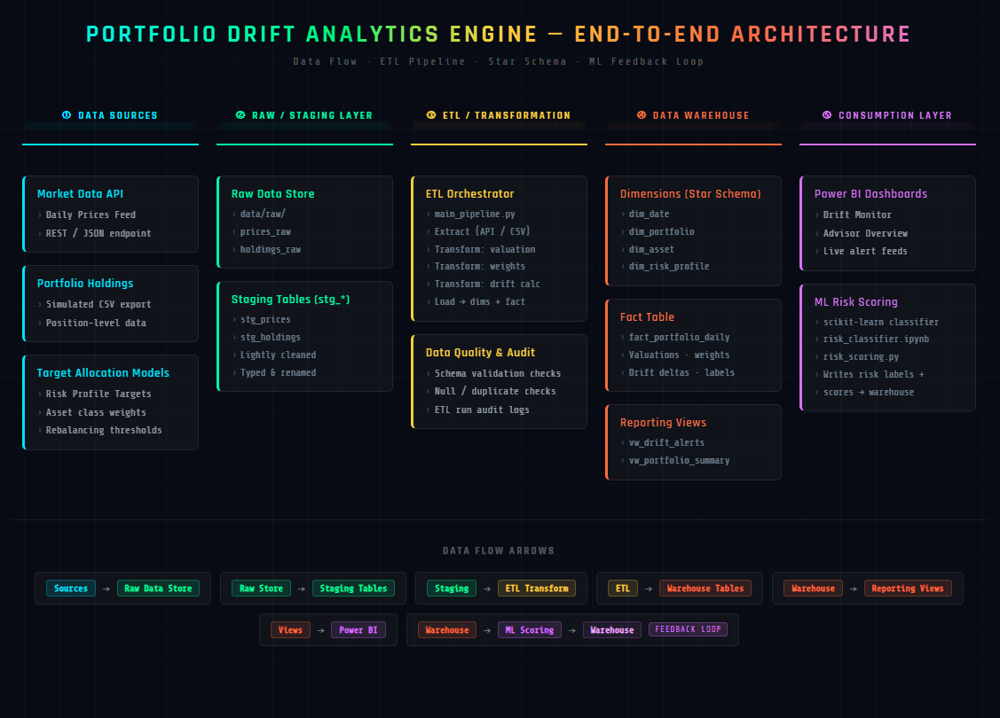

# AI-Driven Portfolio Drift and Rebalancing Analytics Engine

## Executive Summary

Portfolio managers and financial advisors manage client portfolios aligned to a target risk profile (e.g., Conservative, Moderate, Aggressive). Over time, market movements cause **portfolio drift**, where actual allocations deviate from targets (e.g., a 60/35/5 portfolio unintentionally becomes 68/28/4). Drift increases client risk exposure, can violate investment policy guidelines, and creates operational burden because advisors must manually identify which accounts require review.

This project delivers an **AI-Driven Portfolio Drift & Rebalancing Analytics Engine** that automates daily monitoring and produces advisor-ready insights. The system ingests daily market prices and portfolio holdings, computes portfolio value and **asset-class weights**, calculates **drift per asset class**, and flags portfolios when drift exceeds defined thresholds. The ETL layer includes data validation, audit logging, and reconciliation checks to ensure data integrity across daily portfolio calculations.

A dimensional (star-schema) warehouse stores historical portfolio metrics to support fast reporting and time-series analysis. The dimensional model supports fast aggregation by advisor, risk profile, and time, enabling scalable reporting and historical trend analysis. A Power BI dashboard provides two business views: (1) a drift monitor that ranks portfolios by alert severity and (2) an advisor overview with AUM and risk distribution summaries.

To support advanced analytics, the project includes an ML-ready risk scoring layer. The baseline system assigns risk levels from drift policy (Stable/Elevated/High). In later stages, machine learning will refine risk classification using features like drift history and volatility, simulating a lightweight ML Operations workflow in financial analytics.

The system is designed to support a simulated environment of 500–1,000 portfolios with daily recalculation and historical trend tracking. By automating drift detection and ranking portfolios by severity, the engine reduces manual monitoring effort and enables advisors to focus on client communication rather than spreadsheet analysis.

**Outcome:** A scalable, business-integrated analytics solution that improves decision-making, reduces manual review effort, strengthens data governance through validation and audit logs, and demonstrates end-to-end capability across ETL pipelines, data warehousing, reporting, and ML exposure—aligned with Private Asset Management data solutions work.

## Business Context & Assumptions

### Portfolio Context
Private Wealth Management advisors manage client portfolios aligned to a target risk profile (e.g., Conservative, Moderate, Aggressive). Market movements cause allocations to drift away from targets, increasing risk and requiring periodic rebalancing.

### Portfolio Simulation Assumptions (for this project)
- Each portfolio holds a diversified set of assets grouped into 3 asset classes: **Equity**, **Bonds**, and **Cash**.
- Portfolios typically contain **5–12 holdings**, mapped to one of the 3 asset classes.
- Each portfolio is assigned exactly one **risk profile**, which defines its **target allocation**.
- Market prices are updated **daily**. Drift is recalculated **daily**.
- Rebalancing is *recommended* when drift breaches defined thresholds (system generates alerts; it does not execute trades).

### Operating & Scale Assumptions

- Initial simulation supports 500 portfolios, designed to scale to 5,000+.
- Drift is recalculated once per trading day.
- Historical portfolio metrics are stored for time-series analysis.
- Dashboards are designed for advisor-level aggregation (multi-portfolio view).
- The system simulates an internal analytics tool (not a client-facing application).

## Target Allocation Models

| Risk Profile   | Equity | Bonds | Cash |
|----------------|--------|-------|------|
| Conservative   | 35%    | 55%   | 10%  |
| Moderate       | 60%    | 35%   | 5%   |
| Aggressive     | 80%    | 15%   | 5%   |

## Drift Logic (Formal Definition)

Let:
- \( V(t) \) = total portfolio market value on date \( t \)
- \( V_c(t) \) = market value of asset class \( c \in \{Equity, Bonds, Cash\} \) on date \( t \)
- \( w_{actual}(c,t) = \frac{V_c(t)}{V(t)} \) = actual weight of asset class \( c \) on date \( t \)
- \( w_{target}(c) \) = target weight of asset class \( c \) based on the portfolio’s risk profile

Asset-class drift:
\[
drift(c,t) = |w_{actual}(c,t) - w_{target}(c)|
\]

Portfolio drift score (used for alerts):
\[
drift\_score(t) = \max_{c} drift(c,t)
\]

### Why Maximum Drift?

Using the maximum asset-class drift provides a conservative and operationally intuitive alert mechanism. Advisors can immediately identify which asset class has deviated most significantly from policy targets, simplifying rebalancing decisions and communication with clients.

## Drift Threshold Rules (Alert Policy)

| Drift Score (max asset-class drift) |     Status       | Action              |
|-------------------------------------|------------------|---------------------|
|             0% – 3%                 |     Normal       | No action           |
|            >3% – 5%                 |     Watch        | Monitor / review    |
|              >5%                    |  Rebalance Flag  | Recommend rebalance |

## Baseline Risk Levels (Pre-ML)

|      Condition         | Risk Level |
|------------------------|------------|
| Drift = Normal         |   Stable   |
| Drift = Watch          |  Elevated  |
| Drift = Rebalance Flag |    High    |

## System Architecture

## Expected Business Impact

- Proactive identification of portfolios exceeding risk tolerance.
- Enables advisors to prioritize high-risk portfolios first, improving response time to market volatility events.
- Centralized visibility into AUM and risk exposure.
- Foundation for ML-driven portfolio risk scoring.
- Improved governance through validation checks and ETL logging.

## Target Users

- Portfolio Managers
- Financial Advisors
- Operations & Reporting Teams

## Tech Stack
- Python (Pandas, SQLAlchemy)
- SQL (Warehouse + Views)
- Power BI (Dashboards)
- scikit-learn (ML risk scoring - later)
- Git/GitHub (version control)

## Repository Structure

portfolio-drift-analytics-engine/
│
├── README.md
├── requirements.txt
├── .gitignore
│
├── assets/
│   ├── architecture.png
│   └── erd.png   (later)
│
├── data/
│   ├── raw/
│   ├── staged/
│   └── mart/
│
├── etl/
│   ├── extract/
│   ├── transform/
│   ├── load/
│   └── main_pipeline.py
│
├── warehouse/
│   ├── schema.sql
│   ├── dimensions.sql
│   ├── facts.sql
│   └── views.sql
│
├── analytics/
│   ├── sql/
│   └── notebooks/
│
└── dashboards/
    └── powerbi/
