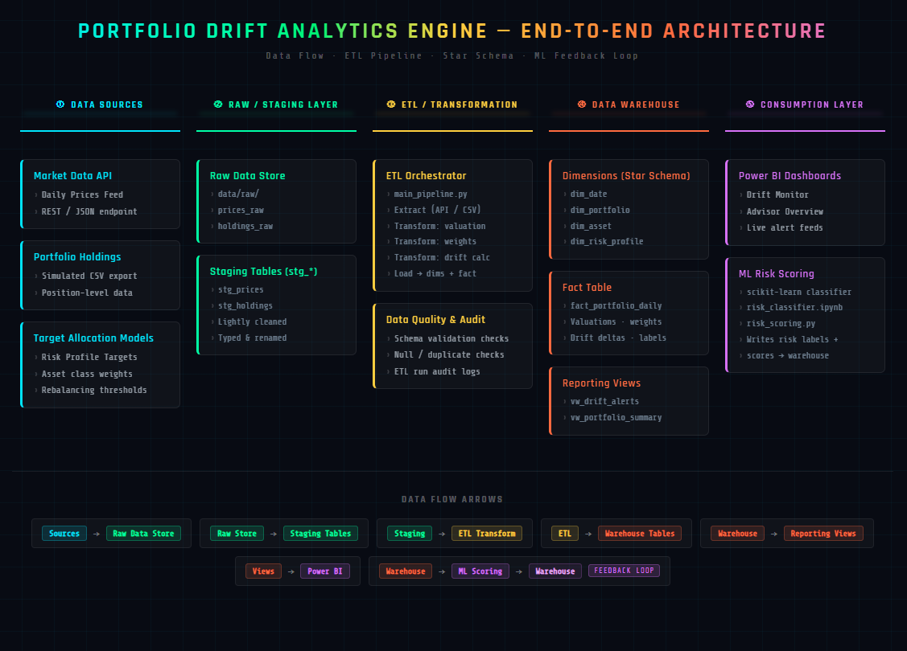
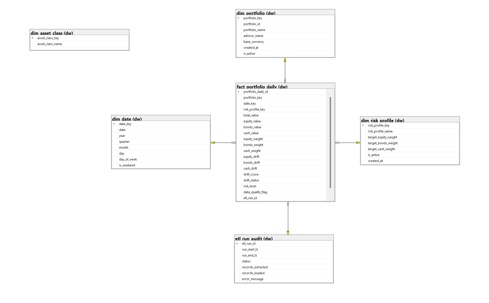

# AI-Driven Portfolio Drift and Rebalancing Analytics Engine

## Overview

This project delivers an automated analytics engine that monitors portfolio drift and generates rebalancing recommendations for Private Wealth Management advisors. The system ingests daily market data and portfolio holdings, calculates asset-class weights, measures drift against target allocations, and flags portfolios that exceed defined thresholds.

The engine is designed to replace manual spreadsheet-based monitoring with a scalable, data-driven workflow that surfaces advisor-ready insights through a Power BI dashboard.

## Problem Statement

Portfolio managers align client portfolios to a target risk profile (Conservative, Moderate, or Aggressive). As markets move, actual allocations drift from those targets. A portfolio designed as 60/35/5 (Equity/Bonds/Cash) may shift to 68/28/4 over time, increasing risk exposure and potentially violating investment policy guidelines.

Identifying which accounts require review is a manual, time-consuming process. This engine automates that detection, ranks portfolios by severity, and enables advisors to focus on client communication rather than data analysis.

## Key Features

- **Daily Drift Monitoring** — Recalculates portfolio weights and drift scores each trading day.
- **Threshold-Based Alerts** — Flags portfolios as Normal, Watch, or Rebalance based on configurable drift rules.
- **Star-Schema Data Warehouse** — Stores historical metrics for time-series analysis with fast aggregation by advisor, risk profile, and date.
- **ETL Pipeline with Validation** — Includes data quality checks, audit logging, and reconciliation at each processing stage.
- **Power BI Dashboard** — Provides a drift monitor ranked by alert severity and an advisor overview with AUM and risk distribution summaries.
- **ML-Ready Risk Scoring** — Baseline deterministic risk levels (Stable/Elevated/High) with a path toward ML-based classification using drift history and volatility features.


## Target Allocation Models

| Risk Profile   | Equity | Bonds | Cash |
|----------------|--------|-------|------|
| Conservative   | 35%    | 55%   | 10%  |
| Moderate       | 60%    | 35%   | 5%   |
| Aggressive     | 80%    | 15%   | 5%   |


## Drift Logic (Formal Definition)

Let:
- **V(t)** = total portfolio market value on date *t*
- **V<sub>c</sub>(t)** = market value of asset class *c* ∈ {Equity, Bonds, Cash} on date *t*
- **w<sub>actual</sub>(c, t) = V<sub>c</sub>(t) / V(t)** = actual weight of asset class *c* on date *t*
- **w<sub>target</sub>(c)** = target weight of asset class *c* based on the portfolio's risk profile

**Asset-class drift:**

$$
drift(c,t) = |w_{actual}(c,t) - w_{target}(c)|
$$

**Portfolio drift score (used for alerts):**

$$
drift\_score(t) = \max_{c} \ drift(c,t)
$$

### Why Maximum Drift?

Using the maximum asset-class drift provides a conservative and operationally intuitive alert mechanism. Advisors can immediately identify which asset class has deviated most significantly from policy targets, simplifying rebalancing decisions and communication with clients.


## Drift Threshold Rules (Alert Policy)

| Drift Score (max asset-class drift) |     Status       | Action              |
|-------------------------------------|------------------|---------------------|
|             0% – 3%                 |     Normal       | No action           |
|            >3% – 5%                 |     Watch        | Monitor / review    |
|              >5%                    |  Rebalance Flag  | Recommend rebalance |


## Baseline Risk Levels (Pre-ML)

|      Condition         | Risk Level |
|------------------------|------------|
| Drift = Normal         |   Stable   |
| Drift = Watch          |  Elevated  |
| Drift = Rebalance Flag |    High    |


## System Architecture


### Data Model


See detailed definitions in [Data Dictionary](docs/data_dictionary.md).

## Expected Business Impact

- Proactive identification of portfolios exceeding risk tolerance.
- Enables advisors to prioritize high-risk portfolios first, improving response time to market volatility events.
- Centralized visibility into AUM and risk exposure.
- Foundation for ML-driven portfolio risk scoring.
- Improved governance through validation checks and ETL logging.


## Target Users

- Portfolio Managers
- Financial Advisors
- Operations & Reporting Teams


## Tech Stack
- Python (Pandas, SQLAlchemy)
- SQL (Warehouse + Views)
- Power BI (Dashboards)
- scikit-learn (ML risk scoring - later)
- Git/GitHub (version control)


## Repository Structure

```
portfolio-drift-analytics-engine/
├── README.md
├── requirements.txt
├── .gitignore
├── assets/
│   ├── architecture.png
│   └── erd.png
├── data/
│   ├── raw/
│   ├── staged/
│   └── mart/
├── etl/
│   ├── extract/
│   ├── transform/
│   ├── load/
│   └── main_pipeline.py
├── warehouse/
│   ├── schema.sql
│   ├── dimensions.sql
│   ├── facts.sql
│   └── views.sql
├── analytics/
│   ├── sql/
│   └── notebooks/
└── dashboards/
    └── powerbi/
```
